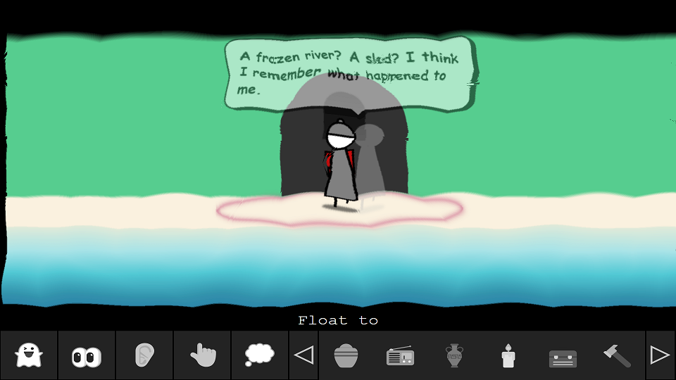

# I've Been Ghosting

"I've Been Ghosting" is a point and click animated adventure game, written for the [2022 js13kGames](https://js13kgames.com/entries/2022) contest.

You control a ghost who doesn't know her name, or how she died, but who offers to help a visitor called Pip to learn more about DEATH as part of his research for building a js13kgames entry. Soon the ghost realises it is Pip that is helping her to remember something.

# Controls

Control the ghost by using the Float to, Look at, Listen to, Touch, and Whisper to icons at the bottom of the screen.

**Float to:** Used for moving around, but you can only walk 1 metre from your urn!!

**Look at:** Used for examining an item or something in the current scene.

**Listen to:** Used for listening to an item or something in the current scene.

**Whisper to:** Used for talking to other characters in the game, although your voice may need a little electronic help.

# Screenshots

     |  
:-------------------------:|:-------------------------:
      |  
     |  

# Credits
**Created By:** Lance Ewing  

**Background Music By:** Lance Ewing  

**Music Synth Library:** [SoundBox] (https://sb.bitsnbites.eu/) by Marcus Geelnard  
